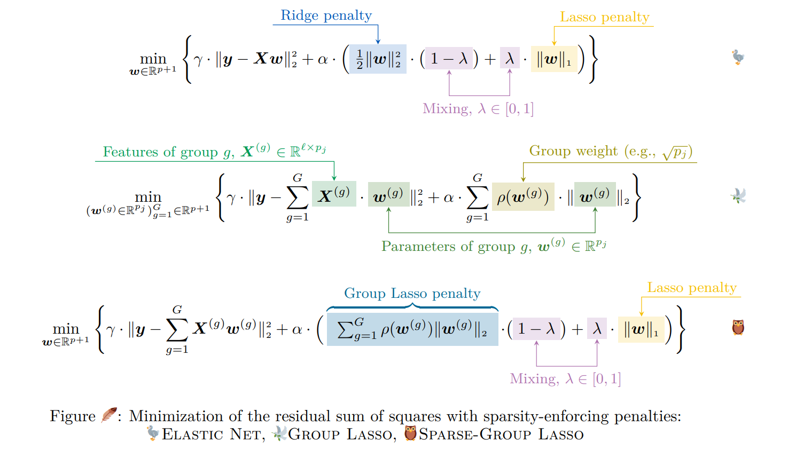

<h1 align="center"> sparse-cheml </h1>



Repository for [Molecular-Property Prediction with Sparsity](https://doi.org/10.26434/chemrxiv-2022-g7mfn). Contains the Python package and scripts for replicating experiments.


## Installation

```shell
conda env create -f environment.yml
conda activate smiles-gpt
pip install git+https://github.com/sanjaradylov/sparse-cheml.git  # This package
pip install requirements_solvers.txt  # To reproduce the experiments with examples/run.py
pip install requirements_test.txt  # To run tests
```


## Citation

> https://doi.org/10.26434/chemrxiv-2022-g7mfn
